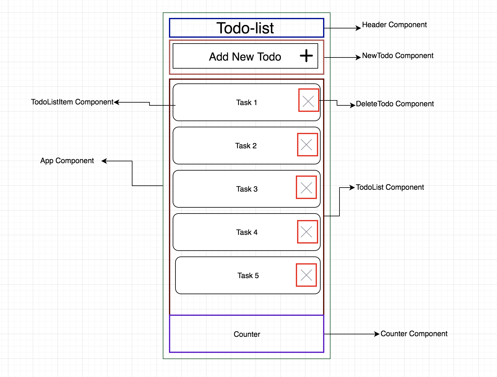

# TodoMVC (React)

###### Description
> A simple TodoList app built using React as part of my Medium.com article on getting started with React. The app allows adding, deleting and checking completion status of todo list items.
It also shows a counter for number of items left to complete in the list.

## Getting Started

These instructions will help you get the project running on your local system.

#### Prerequisites
You need to have Node.js installed on your system.

Clone this repository using:

`git clone https://github.com/RohitNethi/test-react-todomvc.git`

Run `npm install` in the project directory on your local machine.

## Implementation

#### Folder Structure

#### Component Structure

Each component is colored differently to distinguish from each other. The app mainly contains the TodoList Component and App Container.
The App container is the Single Source of Truth and all events are handled here.

Note: I've chosen the above structuring keeping in mind the relatively smaller size of the app.

#### Running the app
To run the app in development on local-server use:

`npm run dev` and go to: `localhost:8080` in your browser

To run the app in production mode use: 

`npm run prod` and open index.html

To run the app in development mode without local-server use:

`npm run start` and open index.html

The app uses SCSS for CSS Pre-processing. The sass files are automatically converted
to css on running the app using `Node-sass` plugin. The output css files are placed in the `Assets` folder

Webpack output's a `bundle.js` file which contains all the transpiled react and es6 code using Babel loaders.

The entry point to the app is `index.html` which has relative path references to the `bundle.js` file, `app.css` and `base.css`.

## Further Improvements

* Stylistic changes to improve the overall look of the app.

* The app can be further optimized in production mode by adding plugins like UglifyJs

* Component structuring can be changed to add more containers so there is lesser data propagation if the app has more added functionality.

## References

[React Documentation](https://reactjs.org/docs)

[Webpack Documentation](https://webpack.js.org/concepts/)

## Credit
Created by [Rohit Nethi](https://github.com/RohitNethi)
