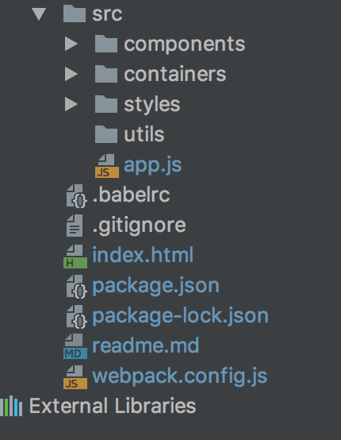

# TodoMVC (React)

###### Description
> A simple TodoList app built using React. The app allows adding, deleting and checking completion status of todo list items.
It also shows a counter for number of items left to complete in the list.

## Getting Started

These instructions will help you get the project running on your local system.

###### Prerequisites
You need to have Node.js installed on your system.

Clone this repository using:

`git clone https://github.com/RohitNethi/test-react-todomvc.git`

Run `npm install` in the project directory on your local machine.

## Implementation

###### Folder Structure

## Credit
Created by Rohit Nethi